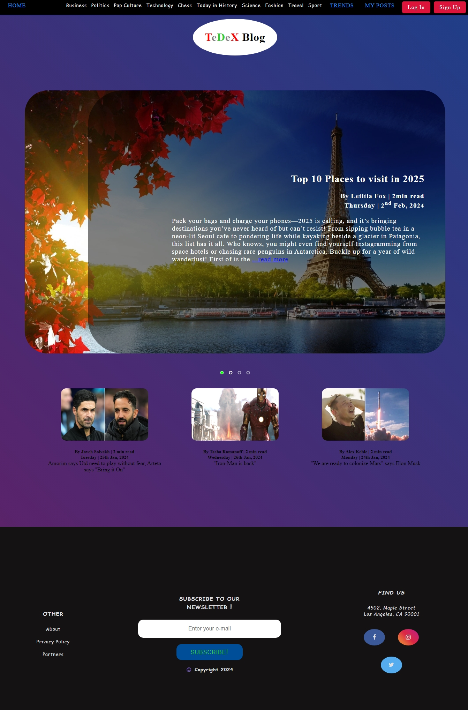
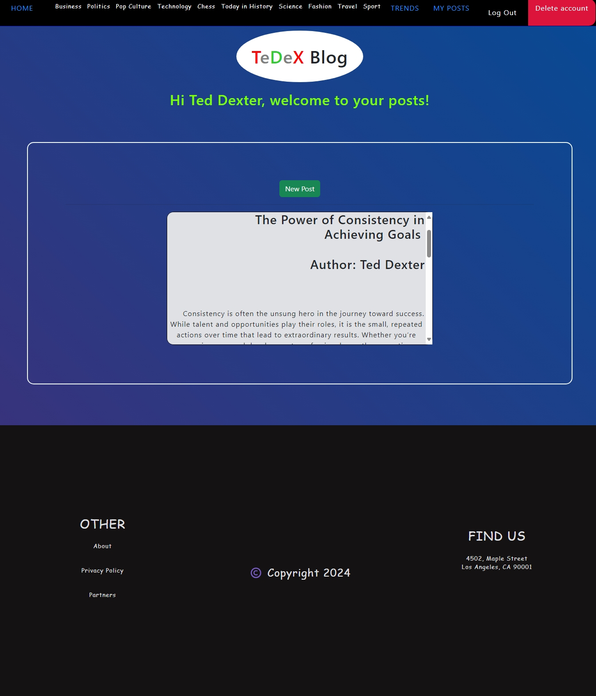

# **Generic Blog Project**

A visually engaging, feature-rich blog website designed with a responsive, user-friendly interface and seamless user experience across devices.

---

## **Project Overview**

This project combines a modern frontend design with a robust backend to deliver a platform where users can read, create, and manage read only blog posts. The application also integrates trending news articles dynamically, ensuring fresh content at all times.

---

## **Key Features**

### **Frontend**

- **Interactive Design**:
  - Horizontal and hamburger navigation bars.
  - Image-based articles with a dynamic image slider.
  - Animated gradient background for a modern aesthetic.
  - Humorous sliding banner displayed on page load.
- **Search Functionality**:
  - Users can search posts by topic, author, or title.
- **Responsive UI**:
  - Optimized for all devices, ensuring smooth interaction.

### **Backend**

- **User Authentication**:
  - Local registration and login with secure email and password storage (salted hashing via Bcrypt).
  - OAuth 2.0 for third-party login support (e.g., Google).
  - Password reset functionality with secure authorization.
- **CRUD Operations**:
  - Users can create, read, update, and delete their own posts.
- **NewsAPI Integration**:
  - Automatically fetch and display the latest trending news.
- **RESTful API**:
  - Secure and efficient communication over HTTPS.

---

## **Tech Stack**

### **Frontend**

- HTML, CSS, and Bootstrap for styling and responsive layouts.
- EJS for dynamic templating.

### **Backend**

- Node.js and Express.js for server-side logic.
- PostgreSQL for database management.
- Bcrypt for secure password handling.
- Passport.js for session management and OAuth 2.0 authentication.
- Axios for API calls.

### **Development Tools**

- **Postman**: For testing and debugging API endpoints.
- **pgAdmin**: For PostgreSQL database management.

---

## **Screenshots**

### Homepage:


_A visually captivating landing page with an animated banner and navigation menu._

### Posts Page:


_Displays client posts with options to create, edit, or delete._

---

## **Demo**

To see the project in action, download and view the demo video:
[Download Demo Video](./assets/TeDex-Blog-demo.mp4)

---

## **Known Issues**

1. **Missing Notifications**:
   - No confirmation message for email reset link sent to the inbox.
   - No notification when a new password is saved.
2. **Authorization Flaws**:
   - Ineffective validation of account ownership during password resets.
3. **Password Confirmation**:
   - "Confirm password" feature is not implemented effectively.
4. **Code Organization**:
   - `app.js` contains all server-side logic, leading to a monolithic structure.
   - Too many CSS files, causing maintainability issues.
   - Some EJS files are not nested properly, affecting structure and reusability.
5. **Visual Glitch**:
   - Gradient transitions experience slight hitches on some mobile devices.

### **Planned Fixes**

- Add user notifications for critical actions (e.g., password resets).
- Implement secure authorization for password reset using unique tokens.
- Refactor `app.js` into modular components.
- Consolidate and optimize CSS files.
- Nest EJS files into logical subfolders.
- Optimize CSS transitions for smoother gradient animations.

---

## **Getting Started**

### **Prerequisites**

- Node.js installed on your system.
- PostgreSQL database installed and running.

### **Installation**

1. Clone the repository:
   ```bash
   git clone https://github.com/teddexter0/Generic-Blog-Project.git
   cd Generic-Blog-Project
   ```
2. Install dependencies:
   ```bash
   npm install
   ```
3. Configure the environment variables:
   Create a `.env` file in the root directory and add the following:
   ```env
   DB_HOST=localhost
   DB_USER=yourusername
   DB_PASS=yourpassword
   DB_NAME=generic_blog_db
   GOOGLE_CLIENT_ID=your-google-client-id
   GOOGLE_CLIENT_SECRET=your-google-client-secret
   SESSION_SECRET=your-session-secret
   ```
4. Set up the PostgreSQL database:

   - Create a database named `generic_blog_db`.
   - Run migrations (if applicable) or manually create tables as specified in `schema.sql`.

5. Start the server:
   ```bash
   npm start
   ```
6. Open your browser and navigate to:
   [http://localhost:3000](http://localhost:3000)

---

## **Potential Future Enhancements**

- Add user profiles with avatars and bios.
- Send email notifications for critical actions (e.g., password reset, new comments).

---

## **Contributing**

Contributions are welcome! If you’d like to help improve or extend this project:

1. Fork this repository.
2. Create a new branch (`git checkout -b feature-name`).
3. Commit your changes (`git commit -m 'Add feature'`).
4. Push to the branch (`git push origin feature-name`).
5. Submit a pull request.

---

## **License**

This project is licensed under the [MIT License](./LICENSE). You are free to use and modify it as long as proper credit is given to the original author.

---

## **Contact**

Created by [Sande Ted Dexter](https://github.com/teddexter0). Feel free to connect via [LinkedIn](https://linkedin.com/in/sande-ted-dexter) or open an issue on GitHub.

## Privacy Policy

This project adheres to a Privacy Policy to ensure data security and transparency. View the full Privacy Policy by navigating to `/privacy` on the application or review the `views/privacy.ejs` file in the codebase.
